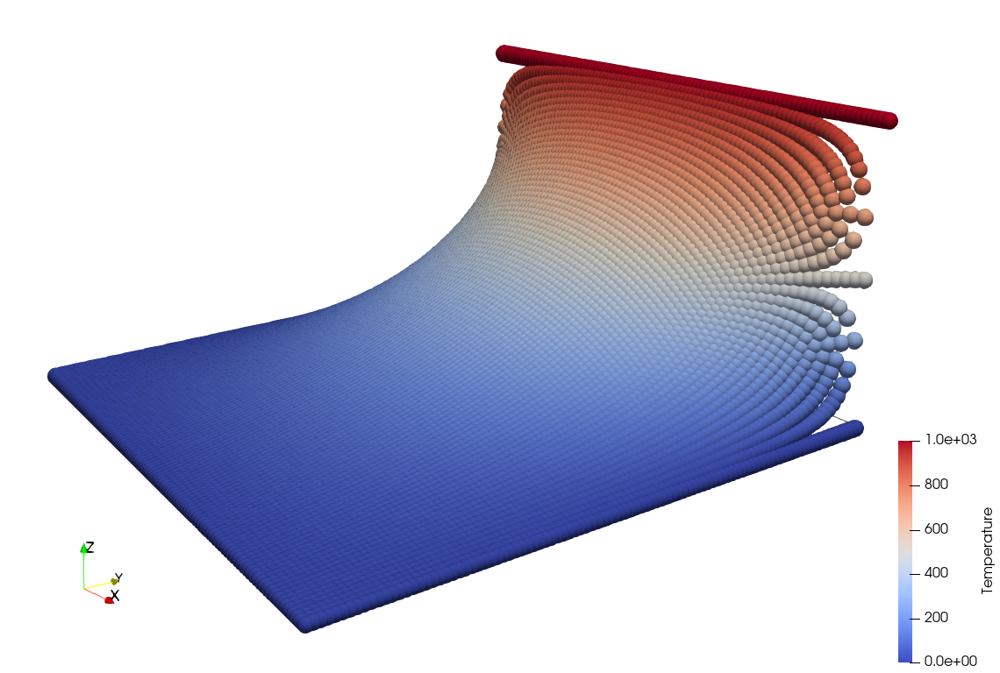

# Laplace Solver

## Theory
We solve 

$$div(\theta)=0$$

Using finite differencing
$$\Delta \theta = \Delta t \, \alpha \ \dfrac{\theta_{(i+1)j}-2\, \theta_{ij} +\theta_{(i-1)j}}{dx^{2}} + \dfrac{\theta_{i(j+1)}-2\, \theta_{ij} +\theta_{i(j-1)}}{dy^{2}}$$

on a purely explicit update 
$$\theta = \theta_{n} + \Delta \theta.$$

## The algorithm
for each timestep do:
* compute increments for each node individually based on current nodal temperatures
* analysis of the increments for a healthy solution - abort or cut time step size
* update time increments for each node
* postprocessing
* next step
  

## Abort criterion
The solver is supposed to achieve a steady state solution. Hence we will check for the change in the increments, wether it reaches a steady state.
Further, the time step size is reduced to half, when this trend is positive.
